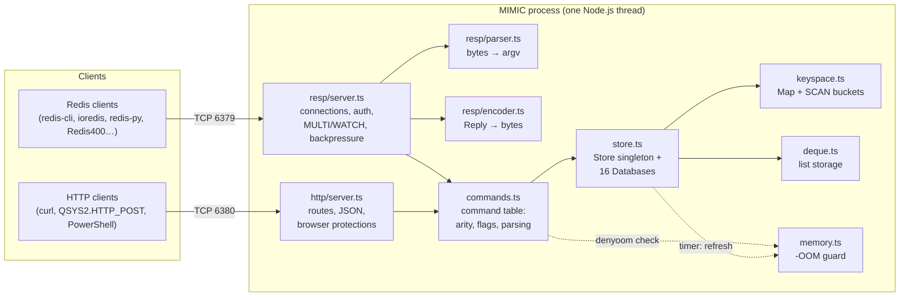
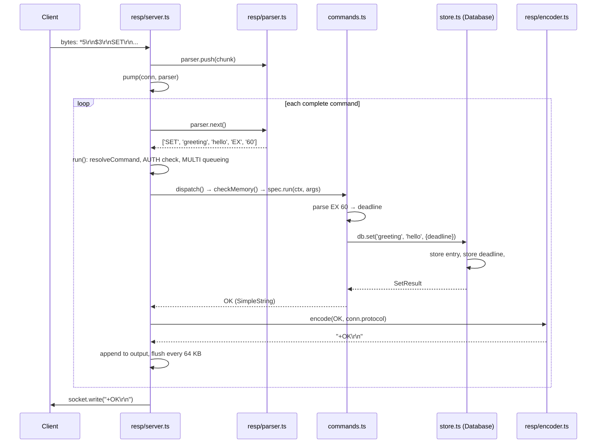
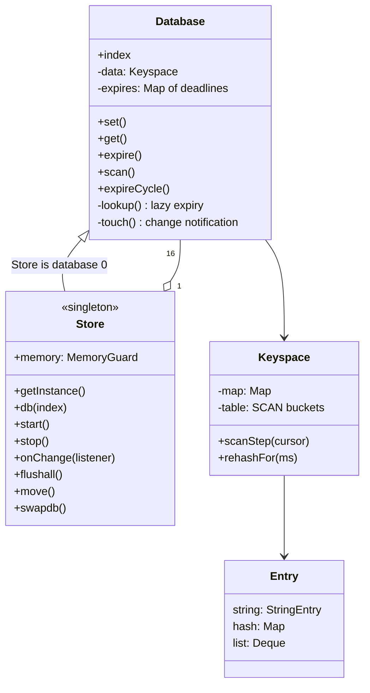

# MIMIC architecture

This is a map of the code for anyone who wants to read, review or change it. It explains how the pieces fit together, follows one command from the socket to the store and back, and suggests an order for reading the source.

MIMIC started from Mateusz Milkowski's design of a singleton store class backed by a `Map`, with lazy and timer-based TTL cleanup. That design is still the heart of the code (`Store` in `src/store.ts`). See [Background](README.md#background) in the README for how the project grew from there.

## Contents

- [The big picture](#the-big-picture)
- [File map](#file-map)
- [Life of a RESP command](#life-of-a-resp-command)
- [Life of an HTTP request](#life-of-an-http-request)
- [Core ideas](#core-ideas)
- [The store in detail](#the-store-in-detail)
- [The RESP server in detail](#the-resp-server-in-detail)
- [Limits and safety nets](#limits-and-safety-nets)
- [Tests](#tests)
- [Adding a command](#adding-a-command)
- [Suggested reading order](#suggested-reading-order)

## The big picture



There are three layers:

1. **Front ends**, which speak a protocol. `resp/` speaks the Redis protocol, and `http/` speaks JSON. They turn requests into an `argv` array (`['SET', 'k', 'v']`) and turn replies back into bytes.
2. **Commands** (`commands.ts`), shared by both front ends. Each command is an entry in one table: how many arguments it takes, what kind of command it is, and a function that validates the arguments and calls the store.
3. **The store** (`store.ts` plus its data structures). This is where data lives, where keys expire, and where every change is announced (for WATCH).

`daemon.ts` wires the three together from the configuration, and `cli.ts` is the `mimic` command.

## File map

| File | Lines | Role |
|---|---|---|
| `src/cli.ts` | ~65 | The `mimic` command: load config, start the daemon, handle signals. |
| `src/daemon.ts` | ~110 | Creates the store, the RESP server and the HTTP server from a config, and shuts them down. |
| `src/config.ts` | ~220 | Flags and `MIMIC_*` environment variables, with validation and the password rules. |
| `src/logger.ts` | ~25 | Timestamped log lines. `debug` exists only at debug level. |
| `src/debuglog.ts` | ~55 | Short descriptions of commands and replies for `--log-level debug`. |
| `src/version.ts` | ~20 | Version numbers (MIMIC's own, and the Redis version it reports). |
| `src/index.ts` | ~30 | The public API when MIMIC is used as a library. |
| `src/bytes.ts` | ~35 | Converting between Buffers, text and *binary strings* (see [Core ideas](#core-ideas)). |
| `src/reply.ts` | ~75 | The reply types every command returns: simple strings, errors, maps, null array, verbatim text. |
| `src/util.ts` | ~165 | Redis-exact integer parsing, the glob matcher used by `KEYS`/`SCAN MATCH`, range helpers, constant-time compare. |
| `src/deque.ts` | ~105 | Ring buffer: O(1) push and pop at both ends, for lists. |
| `src/keyspace.ts` | ~210 | One database's keys: a `Map` for lookups, plus a bucket table that only exists so SCAN can work. |
| `src/memory.ts` | ~185 | The memory guard: refuses growing writes with `-OOM` near the V8 heap limit. |
| `src/store.ts` | ~950 | `Database` (all data operations, expiry, change notifications) and `Store` (the singleton: all databases, the timer, FLUSHALL/MOVE/SWAPDB). |
| `src/commands.ts` | ~685 | The command table, argument parsing, INFO, CONFIG GET, COMMAND. |
| `src/resp/parser.ts` | ~340 | Incremental RESP and inline-command parser with Redis' limits. |
| `src/resp/encoder.ts` | ~50 | Replies → RESP2 or RESP3 bytes. |
| `src/resp/server.ts` | ~545 | The TCP server: connections, AUTH, MULTI/EXEC/WATCH, backpressure, closing. |
| `src/http/server.ts` | ~365 | The HTTP/JSON API and its protections against browser attacks. |

The tests are in `test/` (about 2,300 lines); see [Tests](#tests).

## Life of a RESP command

What happens when a client sends `SET greeting hello EX 60`:



Step by step, with the function names to look for:

1. **Bytes arrive.** The socket's `'data'` handler in `createRespServer()` (`resp/server.ts`) calls `parser.push(chunk)`, then `pump()`. If the client's earlier replies are still backed up (`conn.waitingForDrain`), `bufferWhileBlocked()` only checks the query-buffer limit and waits for `'drain'`.
2. **Parsing.** `pump()` calls `parser.next()` until it returns `undefined` (meaning more bytes are needed). `RespParser` keeps partial frames between chunks, so a command split across TCP packets is fine. It returns an `argv` of binary strings, or throws `ProtocolError` for malformed input. Before AUTH it applies Redis' smaller limits.
3. **The HTTP probe check.** If the first word is `POST` or a `Host:` header, the connection is dropped silently. That's how Redis blocks cross-protocol attacks from web pages.
4. **`run()`** decides what to do with the command, in Redis' order:
   - `resolveCommand()` (`commands.ts`) looks the name up in `COMMANDS` and checks the arity. Unknown command and wrong argument count come **before** the AUTH check, as in Redis.
   - Not authenticated, and not `AUTH`/`HELLO`/`QUIT`…? → `NOAUTH`.
   - Inside `MULTI`? Then the command is queued (`+QUEUED`), apart from `EXEC`, `DISCARD`, `WATCH`… which are handled here.
   - The transaction commands (`MULTI`, `EXEC`, `DISCARD`, `WATCH`, `UNWATCH`) and `RESET` are handled right here in the server.
   - Everything else goes to `dispatch()`. Commands that change the connection, such as `SELECT`, `HELLO` or `CLIENT SETNAME`, live in `commands.ts` like any other and reach the connection through `ctx.conn` (the `ConnectionHandle` interface).
5. **`dispatch()`** calls `checkMemory()` (refuses `denyoom` commands with `-OOM` while over the memory limit), then the command's `run()` function. A `ReplyError` thrown anywhere below becomes an error reply. Any other exception becomes `-ERR internal error` and is logged.
6. **The command** (`COMMANDS.SET` in `commands.ts`) parses its options (`parseExtendedOptions()`), turns `EX 60` into an absolute deadline, and calls `ctx.db.set()`.
7. **The store** (`Database.set()` in `store.ts`) writes the entry, records the deadline in its expiry map, and calls `#touch(key)` so WATCH sees the change.
8. **Encoding.** The returned `Reply` goes through `encode(reply, conn.protocol)` (`resp/encoder.ts`), which produces RESP2 or RESP3 bytes as a binary string.
9. **Writing.** Replies are collected and written in pieces of up to 64 KB. If `socket.write()` says the buffer is full, `pump()` stops running commands, sets `waitingForDrain`, and resumes on `'drain'`. That's the backpressure that keeps memory bounded when a client sends faster than it reads.

## Life of an HTTP request

`POST /command` with `["SET","greeting","hello"]`:

1. `createHttpServer()` (`http/server.ts`) receives the request. `route()` checks the path and method.
2. `checkBrowserSafety()` refuses cross-site browser requests (`Origin`, `Sec-Fetch-Site`, and, without a password, the `Host` header against DNS rebinding). `authorised()` checks the Bearer token if a password is set.
3. `readJson()` reads the body (requires `Content-Type: application/json`, enforces the size limit) and refuses integers JSON can't carry exactly (`findUnsafeInteger()`).
4. `parseCommand()` turns the JSON into `argv`, converting text to UTF-8 binary strings with `toArg()`. `?db=N` picks the database.
5. `run()` calls `execute()` from `commands.ts`: the same command table, the same memory check, the same store.
6. `toJson()` turns the `Reply` into JSON (binary strings back to text, big integers as exact JSON numbers), and `send()` writes the response.

HTTP has no connection state: no `SELECT`, no `MULTI`. `/pipeline` runs a batch of commands in one go, which is atomic for the reason below.

## Core ideas

**One thread, so every command is atomic.** Node runs one piece of JavaScript at a time, and MIMIC never `await`s inside a command. A command, a `MULTI`/`EXEC` block or an HTTP `/pipeline` runs from start to finish without anything else touching the data. There are no locks anywhere, and none are needed. The flip side: a slow command (for example `KEYS *` on millions of keys) delays every other client, just as in Redis.

**Binary strings.** Redis keys and values are byte arrays, not text. MIMIC stores them as JavaScript strings where each character holds one byte (0–255), sometimes called "latin1" or "binary" strings. V8 stores such strings at one byte per character, they work as `Map` keys, and they round-trip any bytes a client sends. `bytes.ts` converts:

- `fromBuffer` / `toBuffer`: network bytes ↔ binary string (no copying of meaning, one char = one byte);
- `fromText` / `toText`: real text ↔ its UTF-8 bytes as a binary string (used by the HTTP API, where JSON strings are text).

So `'cześć'` from HTTP is stored as 7 characters (its 7 UTF-8 bytes), and `STRLEN` returns 7, exactly as Redis would. Whenever you see a string in the store, think "bytes".

**Replies are values, not bytes.** Commands return a `Reply` (`reply.ts`): a binary string (bulk string), a number or `bigint` (integer), `null`, an array, a `SimpleString` (`+OK`), a `ReplyError`, a `MapReply`, a `NullArray` or a `VerbatimString`. Commands don't know which protocol is in use. The RESP encoder turns them into RESP2 or RESP3, and the HTTP server into JSON. A `MapReply`, for example, becomes a RESP3 map, a flat RESP2 array, or a JSON object.

**Errors are exceptions.** Anything the client should see as an error is a `ReplyError` thrown from wherever it's detected (`WrongTypeError` for `WRONGTYPE`). The front ends catch it and send it as an error reply. The message must match Redis exactly; the comparison tests check that.

**Integers are exact.** Counters are signed 64-bit, as in Redis, so `INCR` and friends use `bigint`. `toInt`/`toInt64` in `util.ts` follow Redis' `string2ll` rules ("007", "+5" and "-0" are not integers).

**Redis compatibility is a test, not a goal.** Where Redis has a quirk (an odd error message, an unusual argument order, a clamping rule), MIMIC copies it, and the comparison test fails if they ever differ. Comments usually name the Redis function a piece of code mirrors, so you can look at the Redis source for the reference.

## The store in detail



**`Store` is a singleton and is database 0.** `Store.getInstance()` creates it once; the constructor refuses to run any other way. `Store` extends `Database`, so code that only ever uses database 0, such as an embedding application, can call `store.set()` directly. The other 15 databases are plain `Database` objects sharing the same options, statistics and listeners.

**Each key's value is an `Entry`** tagged with its type: `{ type: 'string', value: StringEntry }`, `{ type: 'hash', value: Map }` or `{ type: 'list', value: Deque }`. `StringEntry` holds a string, and switches to a growable Buffer once `APPEND` makes a value larger than 4 KB, so building a value piece by piece isn't quadratic.

**Every read goes through `#lookup()`, and that's where lazy expiry happens.** If the key's deadline has passed, it's deleted on the spot and the caller sees "no such key". So a client can never read an expired value, even if the timer hasn't run.

**Active expiry** runs on the store's timer (`Store.start()`, every `cleanup-interval` ms). `activeExpireCycle()` visits the databases round-robin. In each one, `expireCycle()` samples keys that have a TTL, deletes the expired ones, and repeats while more than 25% of a sample had expired, within the time budget. That's Redis' algorithm. It keeps memory from filling with expired keys nobody reads. The same timer also moves the SCAN bucket table forward (`rehashFor(1)`) and lets the memory guard re-measure the heap.

**Change notifications.** Every real modification calls `#touch(key)` (or `#touchAll()` for FLUSHDB/FLUSHALL/SWAPDB), which calls every listener registered with `store.onChange()`. Writes that change nothing, such as a failed `SETNX`, don't notify. That's Redis' `signalModifiedKey`. The RESP server's WATCH is one listener. Because notifications come from the data layer, WATCH also sees changes made over HTTP, by expiry, or by an application that embeds MIMIC.

**SCAN** (`keyspace.ts`). Lookups use a plain `Map`. On the side, every key is also placed in one of a power-of-two number of *buckets* by a seeded hash. A SCAN cursor is a bucket position, and it advances in *reverse-binary* order (`advance()`), which is Redis' `dictScan` trick. Because of that ordering, a scan that started before the table doubled or halved still visits every bucket that holds its keys, so no key that existed for the whole scan is missed. When the table needs to grow or shrink, the new table is filled *incrementally*, a few buckets per write plus 1 ms per timer tick, and `scanStep()` walks both tables meanwhile. The comments in `keyspace.ts` go through the details; this is the hardest algorithm in the project.

**Lists** use `Deque` (`deque.ts`), a ring buffer over an array, so `LPUSH`/`LPOP` are O(1) instead of the O(n) of `Array.unshift()`. `LTRIM` only touches the elements it removes.

**The memory guard** (`memory.ts`). Everything is stored on the V8 heap, which has a hard ceiling; reaching it kills the process. `MemoryGuard` measures the heap's old generation against a share of that ceiling (`--max-memory-percent`, default 80%, always at least 32 MB below it). It re-measures every 256 commands or 256 KB of writes, and on every timer tick. While it's over the limit, `checkMemory()` in `commands.ts` refuses commands flagged `denyoom` with Redis' `-OOM` error, exactly like Redis' `maxmemory` with the `noeviction` policy. Because freed memory only shows up after a garbage collection, the guard can force one (rate-limited) while it's over the limit, and right after FLUSHDB/FLUSHALL.

## The RESP server in detail

**`Connection`** holds one client's state: the selected database, protocol version (2 or 3), whether it's authenticated, its name, the `MULTI` queue, the watched keys, and flags for closing and backpressure. `describe()` produces the `CLIENT INFO` line.

**Authentication** (`Connection.authenticate()`) follows Redis' rules for the `default` user: `AUTH password` and `AUTH default password`, `HELLO … AUTH`, `WRONGPASS` for anything else, and a special message when no password is configured. The password is compared with `safeEqual()` (constant time).

**Transactions.** `MULTI` starts a queue. Commands are checked (existence, arity, memory) when they're queued; an error marks the transaction as failed, and `EXEC` then answers `EXECABORT`. `exec()` runs the queue in one go (atomic, see [Core ideas](#core-ideas)).

**WATCH.** `watch()` records `db + key` for the connection in a shared index, and the store's change listener marks every connection watching a changed key as *dirty*. `EXEC` on a dirty connection returns a null array, so the client knows to retry. Before checking, `exec()` looks up each watched key once, so a key that expired since WATCH counts as changed (Redis ≥ 6.0.9).

**Backpressure and closing.** Two mechanisms keep memory bounded:

- *Output:* `pump()` stops running a client's commands while its replies are backed up. Input keeps being read and buffered, so a client that writes a whole pipeline before reading can't deadlock with the server. If the buffered input exceeds `--max-query-buffer`, the client is disconnected.
- *Closing:* `endAndRelease()` sends any final reply and closes the connection, but destroys the socket if the client stops reading for `CLOSE_GRACE_MS` (5 s). A slow reader still gets everything; a client that never reads can't hold a socket open forever.

## Limits and safety nets

Most of these exist because a review round found a way to crash or stall the server. `review.test.ts` and `edge.test.ts` have a test for each.

| Limit | Where | Protects against |
|---|---|---|
| Before AUTH: 10 arguments, 16 KB each | `resp/parser.ts` (`UNAUTHENTICATED_LIMITS`) | Unauthenticated clients making the server buffer a lot of data |
| `--max-bulk-bytes` (64 MB per value) | `resp/parser.ts` | A single huge value |
| `--max-query-buffer` (1 GB per client) | `resp/server.ts` | A client that sends without ever reading |
| Replies written in 64 KB pieces | `resp/server.ts` (`pump()`) | Replies larger than V8's maximum string length (~512 MB) |
| `-OOM` near the heap limit | `memory.ts`, `commands.ts` | The process dying from heap exhaustion |
| Glob matching without regular expressions, with Redis' nesting and "skip longer" limits | `util.ts` (`globMatch()`) | Patterns like `*?*?*?…x` that make matching take exponential time |
| Integer arguments over 20 characters rejected before parsing | `util.ts` (`toInt()`) | Multi-megabyte numbers stalling the event loop |
| Seeded bucket hash | `keyspace.ts` | Keys chosen to collide on purpose |
| HTTP body limit, JSON Content-Type, Origin, Sec-Fetch-Site and Host checks | `http/server.ts` | Web pages writing to or reading from the cache |
| `POST`/`Host:` on the RESP port drops the connection | `resp/server.ts` (`isHttpProbe()`) | Cross-protocol attacks from browsers |

[SECURITY.md](SECURITY.md) covers the security model and the known gaps.

## Tests

```
npm test               # unit and integration tests (no Redis needed)
npm run test:compat    # + real Redis clients and the redis-server comparison
```

| File | What it checks |
|---|---|
| `keyspace`, `deque`, `parser` | The data structures and the parser on their own, including SCAN's guarantee while the table resizes and byte-by-byte parsing. |
| `store` | `Database`/`Store` directly: types, expiry, databases, notifications. |
| `resp`, `http` | The servers end to end over real sockets. |
| `review`, `edge`, `debuglog` | One regression test per finding from the review rounds, named after the problem. |
| `compat.clients` | ioredis, node-redis and redis-cli against MIMIC. |
| `compat.redis-diff` | **The most important one.** Starts a real `redis-server`, sends both servers the same commands and requires byte-identical replies: hand-picked cases, protocol errors, authentication, and seeded random streams over RESP2 and RESP3 (`FUZZ_SEED=<n>` replays a run). |

If you change behaviour and the comparison test still passes, you haven't broken Redis compatibility. If you're not sure what Redis does, add the case to `compat.redis-diff.test.ts` and let it tell you.

## Adding a command

For example, adding `HSTRLEN key field` (the length of one hash field's value):

1. **Store:** add a method on `Database` (`hstrlen(key, field)`). Read through `#typed(key, 'hash')` so expiry and `WRONGTYPE` are handled. If the method modifies data, call `#touch(key)`, and `#dropIfEmpty()` if a hash or list can become empty.
2. **Command table:** add an entry to `COMMANDS` in `commands.ts`: `spec(arity, flags, keys, run)`.
   - *arity:* the exact argument count including the name (`3`), or a negative minimum (`-3` = at least 3).
   - *flags:* `R` (read), `W` (write), `WD`/`WDS` (write that can grow memory, refused with `-OOM` near the limit). Anything that can add data must be `denyoom`.
   - *keys:* `[first, last, step]` key positions, as in Redis' `COMMAND` output.
   - *run:* parse the arguments (throw `ReplyError` with Redis' exact wording) and call the store.
3. **Tests:** add cases to `compat.redis-diff.test.ts`, including wrong types, missing keys and bad arguments. If Redis is installed, run `npm run test:compat`.
4. **Docs:** the command list in the README, and the CHANGELOG.

The command is then available over RESP, over HTTP, in `MULTI` and in `COMMAND` output, with no other changes.

## Suggested reading order

Bottom-up, so each file only uses things you've already read. Reading carefully, it's about 15–20 hours in total.

1. **Basics:** `version`, `bytes`, `reply`, `resp/encoder`, `logger`, `debuglog`. Take away the binary-string idea and the reply types.
2. **Helpers:** `util`. `toInt` matters everywhere; skim `globMatch`, which mirrors Redis' C code.
3. **Data structures:** `deque`, then `keyspace`. Read the comments at the top of `keyspace.ts` before the code.
4. **The store:** `store` (start with `#lookup`, `#touch`, `set`, `get`, `expireCycle`, then the `Store` class at the bottom), then `memory`.
5. **Commands:** `commands`. Follow three commands completely: `SET … EX … NX`, `EXPIRE … GT` and `SCAN`.
6. **The protocol:** `resp/parser`, then `resp/server` (start with the `'data'` handler, then `pump()`, `run()`, `dispatch()`, `exec()`).
7. **The edges:** `http/server`, `config`, `daemon`, `cli`, `index`.

To see it move, run `node --inspect-brk dist/cli.js`, attach VS Code or Chrome DevTools, and put breakpoints in `RespParser.next()`, `COMMANDS.SET` and `Database.set()`. Source maps are built, so you step through the TypeScript. Then send a command with `redis-cli` or the HTTP API.

Reading each module next to its tests helps, and so does breaking things on purpose: delete a line you don't understand, run `npm test`, and see which test explains it.
